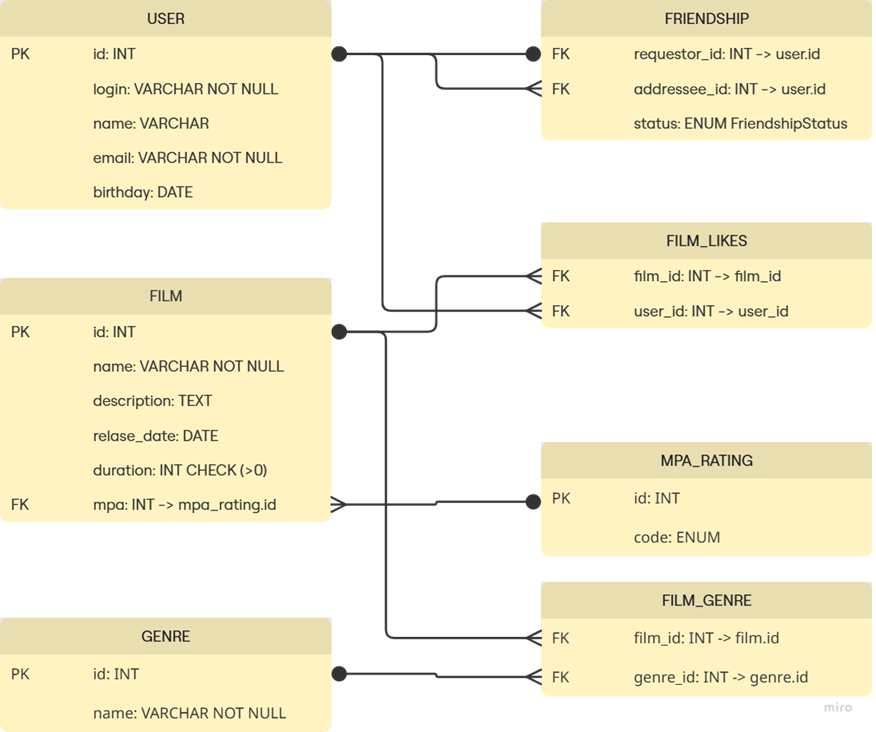

# java-filmorate
Template repository for Filmorate project.

### Основные сущности

**User** — пользователь системы.
- Поля: id, email, login, name, birthday.
- Пользователь может добавлять друзей и лайкать фильмы.

**Film** — фильм в каталоге.
- Поля: id, name, description, releaseDate, duration, mpa.
- У фильма есть возрастной рейтинг (ссылка на MpaRating), набор жанров и лайки от пользователей.

**MpaRating** — возрастные рейтинги MPAA (G, PG, PG-13, R, NC-17).
- Связь: один рейтинг может быть у многих фильмов.

**Genre** — жанры фильмов.
- Хранится в отдельной таблице, чтобы можно было расширять список без изменения кода.

### Связующие таблицы

**Friendship** — хранит связи дружбы между пользователями.
- requester_id, addressee_id → оба ссылаются на User.id.
- status (подтверждена или нет).
- Таким образом реализована связь User ↔ User.

**Film_Genre** — промежуточная таблица для связи многие-ко-многим между фильмами и жанрами.
- Один фильм может иметь несколько жанров. 
- Один жанр может принадлежать множеству фильмов.

**Film_Likes** — промежуточная таблица для лайков (многие-ко-многим между User и Film).
- Один пользователь может лайкнуть много фильмов.
- Один фильм может получить лайки от многих пользователей.

### ER-диаграмма


### Примеры SQL-запросов
Создать пользователя:
```sql 
INSERT INTO user (email, login, name, birthday)
VALUES ('user@mail.com', 'login123', 'Иван Иванов', '1990-05-12');
```
Найти пользователя по id:
```sql
SELECT * FROM user WHERE id = 1;
```
Удалить пользователя:
```sql
DELETE FROM user WHERE id = 1;
```
Добавить фильм:
```sql
INSERT INTO film (name, description, release_date, duration, mpa_rating_id)
VALUES ('Матрица', 'Научно-фантастический боевик', '1999-03-31', 136, 4);
```
Обновить фильм:
```sql
UPDATE film
SET description = 'Культовый фантастический боевик'
WHERE id = 1;
```
Получить фильм с жанрами и рейтингом:
```sql
SELECT f.*, 
       m.name AS mpa_rating, 
       ARRAY_AGG(g.name) AS genre
FROM film f
JOIN mpa_rating m ON f.mpa_rating_id = m.id
LEFT JOIN film_genre fg ON f.id = fg.film_id
LEFT JOIN genre g ON fg.genre_id = g.id
WHERE f.id = 1
GROUP BY f.id, m.name;
```
Добавить новый жанр:
```sql  
INSERT INTO genres (name) VALUES ('Фантастика');
```
Привязать жанр к фильму:
```sql
INSERT INTO film_genres (film_id, genre_id) VALUES (1, 1);
```
Все жанры конкретного фильма:
```sql
SELECT g.*
FROM genre g
JOIN film_genre fg ON g.id = fg.genre_id
WHERE fg.film_id = 1;
```
Поставить лайк фильму:
```sql
INSERT INTO film_likes (film_id, user_id) 
VALUES (1, 2);
```
Топ-5 фильмов по лайкам:
```sql
SELECT f.id, f.name, COUNT(fl.user_id) AS likes
FROM film f
LEFT JOIN film_likes fl ON f.id = fl.film_id
GROUP BY f.id
ORDER BY likes DESC
LIMIT 5;
```
Отправить заявку в друзья:
```sql
INSERT INTO friendship (requester_id, addressee_id, status)
VALUES (1, 2, 'UNCONFIRMED');
```
Подтвердить заявку в друзья:
```sql
UPDATE friendship
SET status = 'CONFIRMED'
WHERE requester_id = 1 AND addressee_id = 2;
```
